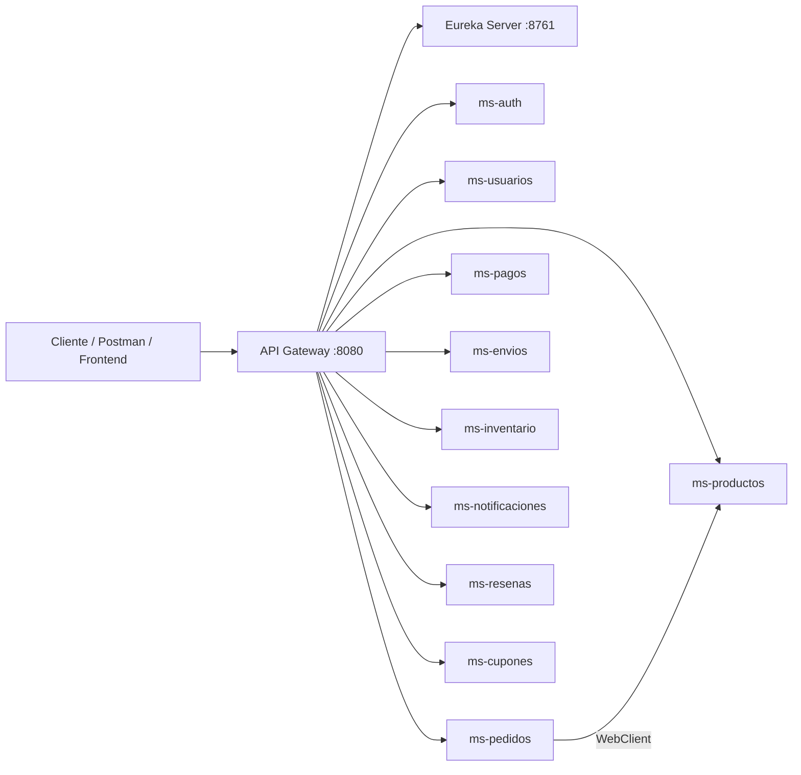
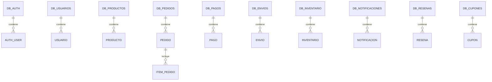

# FoodExpress - Proyecto Semestral Microservicios

Equipo de Trabajo Marcial Lagos , Rainer Gomez

Sistema de pedidos de comida implementado con arquitectura de microservicios Spring Boot.

## Cumplimiento de directrices

| Requisito | Implementación |
|---|---|
| API Gateway | `api-gateway`, puerto `8080` |
| Service Register | `eureka-server`, puerto `8761` |
| 10 microservicios independientes | auth, usuarios, productos, pedidos, pagos, envios, inventario, notificaciones, resenas, cupones |
| Base de datos por microservicio | Cada servicio usa su propia base MySQL `db_*` |
| API REST | Controllers por dominio, endpoints CRUD y operaciones específicas |
| JWT / tokens | `ms-auth` genera JWT y el `api-gateway` valida Bearer Token |
| Roles | CLIENTE, ADMIN, REPARTIDOR |
| Contraseñas encriptadas | BCrypt en autenticación |
| Comunicación entre microservicios | `ms-pedidos` consulta `ms-productos` con WebClient balanceado por Eureka |
| Validaciones | Bean Validation con `@Valid`, `@NotBlank`, `@NotNull`, etc. |
| Pruebas unitarias | Tests unitarios base en productos y pedidos con Mockito |

## Orden recomendado de ejecución

1. `eureka-server`  
2. `api-gateway`  
3. `ms-auth`  
4. Microservicios de negocio: `ms-productos`, `ms-pedidos`, `ms-pagos`, etc.

## Autenticación

1. Registrar usuario en:

```http
POST /api/v1/auth/register
```

2. Iniciar sesión en:

```http
POST /api/v1/auth/login
```

3. Usar el token retornado en los demás endpoints:

```http
Authorization: Bearer <token>
```

El Gateway bloquea las rutas privadas cuando no existe token o el token es inválido.

## Comunicación entre microservicios

Al crear un pedido, `ms-pedidos` no confía en el precio enviado desde el cliente. Consulta directamente a `ms-productos` mediante:

```java
http://ms-productos/api/v1/productos/{id}
```

Luego calcula el total y descuenta stock con:

```java
PUT http://ms-productos/api/v1/productos/{id}/stock/decrement?cantidad={cantidad}
```

Esto demuestra comunicación real entre servicios usando Eureka + LoadBalancer.

## Diagrama de arquitectura



## Diagrama lógico de bases de datos




